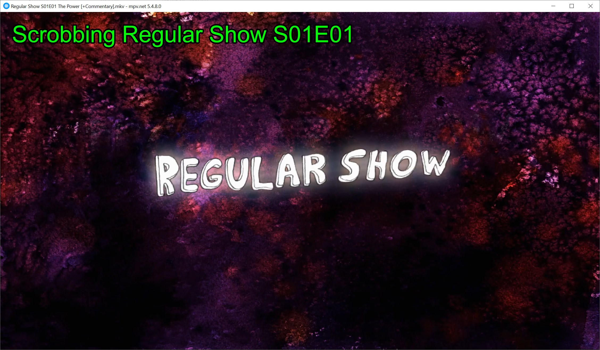
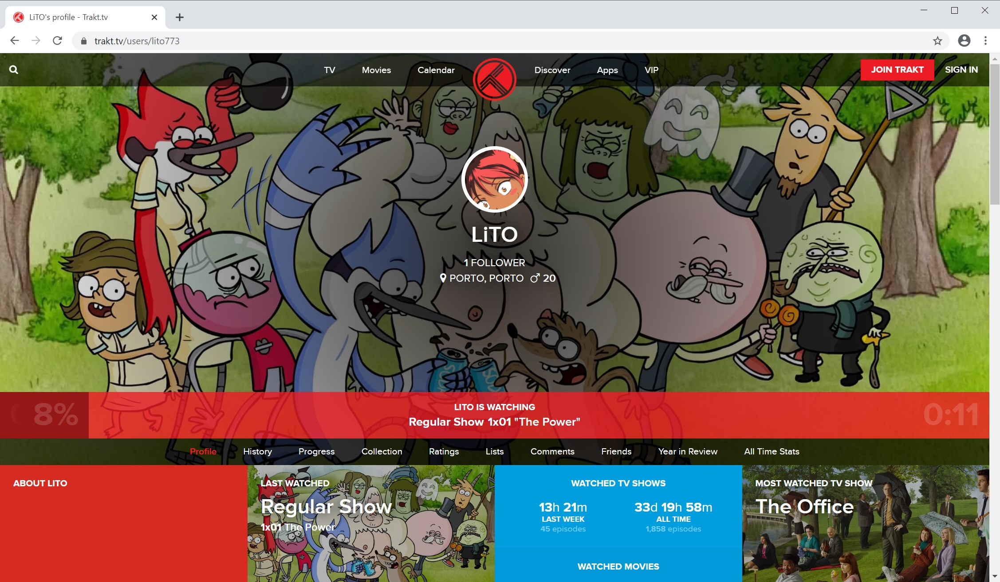

# trakt-mpv

A MPV script that checks in your movies and shows with Trakt.tv without the need for an IPC server.

|  |  |
| ------------------------------------------ | -------------------------------------------- |


## How does it work?

This script is written in both Lua and Python. The Lua part works as a front-end while the Python script is responsible for communicating with Trakt.tv.

This dual-language approach was needed since mpv scripts aren't able to send http requests and/or edit files natively.

## How to install?

### Pre-requisites

In order for this script to work you need to make sure you have Python 3 installed.

After that, make sure you also have the `requests` module. You can install it like this:

```
pip install requests
```

### Installing

The install is pretty simple and can be done with the following steps:

1. Move `trakt-mpv.lua` and `trakt-mpv` folder to your scripts folder
   - *NOTE: If you are on Windows it will automatically assume that you are using mpv.net with the configuration in APPDATA. If you aren't please change it in the lua script `evoque_python` function.*
2. Create a trakt.tv api. You can do this using: [https://trakt.tv/oauth/applications](https://trakt.tv/oauth/applications)
3. Copy your `client_id` and `client_secret` to `trakt-mpv/config_example.json`
4. Rename `trakt-mpv/config_example.json` to `trakt-mpv/config.json`

Ok the hard part is done, now you'll do the rest in mpv. If you did everything correctly when you open a file the following message will appear: 


Press X and follow the instructions on the screen. After that you are all set 😀.

## Behaviors

The current behaviors adopted by the plugin are:

 - It will start a scrobble as soon as the video starts.
 - If you starting watching something while trakt.tv is still scrobbing, it will stop the scrobble, count it as seen and start scrobbing the current file (independently of how much you watched the previous one).
 - Right now there really isn't a good error reporting. So if you find an error I suggest you look at the mpv console.

## Improvements

Some improvements that can be done are:

[] Start scrobbing only after x seconds of playback. This would avoid acidental scrobbles.
[] Allow the user to cancel a scrobble.
[] Allow a backup plan for when the show/movie isn't recognized.
[] Test in platforms other than Windows and mpv.net.

## Contributing

Pull requests are very welcome. I don't have a strict CONTRIBUTING guide since this is a small project, so just make sure you are clear on what you worked on 😉.

## License

[MIT](https://choosealicense.com/licenses/mit/)